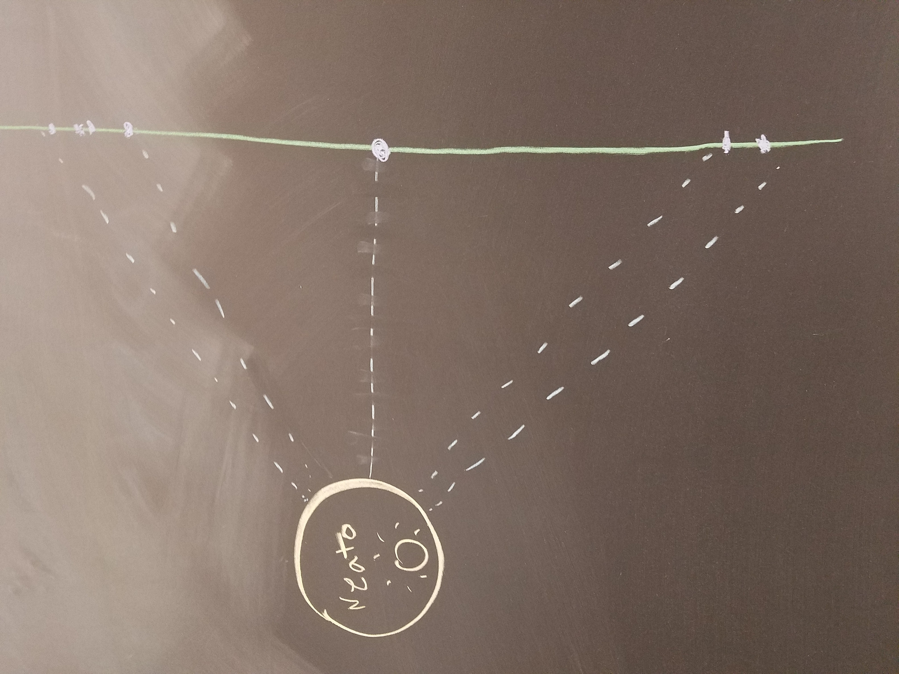
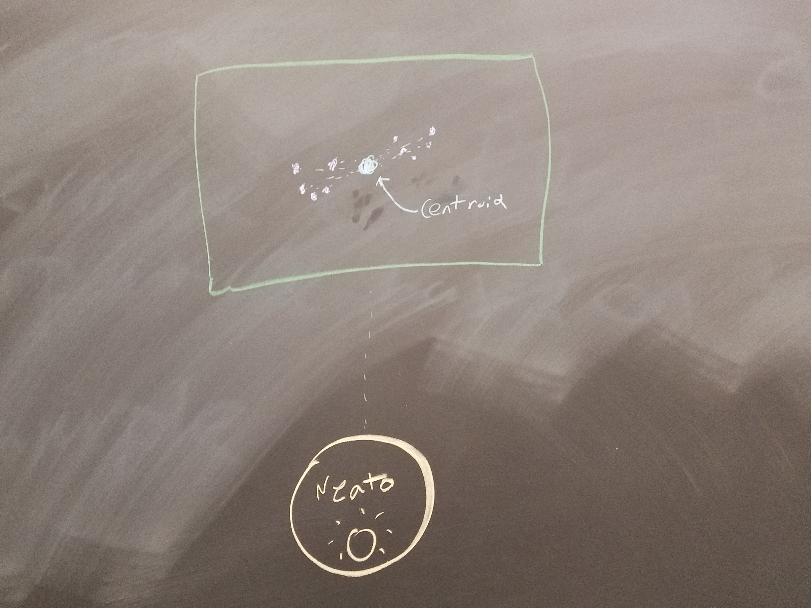

## Comprobo Project 1
###### Sean Carter and Paul Krusell

###### Project Overview:
The goal of this project was to get a neato (pictured above) to execute a number of basic robotic behaviors. We had access to all of the basic information that the neato generates, which included:
- Four bump sensors (to physically detect obstacles)
- A LIDAR scanner
- Odometers in the wheels
- A camera (not used for these behaviors)

To control the robot, we could set velocity and rotation speed based on logic written in Python.

###### General Code Structure:
All code for a single behavior has the same structure There is an object that represents the robot, with the same features:
- When initiated, it sets up the rosnode and all necessary publishers and subscribers.
- It has callback functions that take in sensor data, and assigns it to values that the rest of the robot object can use.
- Each one has a run() function, which implements the logic of the behavior
- There are functions which create and publish visualizations
- Finally, there are a number of helper functions that assist with math

###### Teleoperation:
Our teleop code is very simple, and the only exception to the object oriented structure. It starts by commanding the robot to stay still. We have a function that waits for a keypress in the terminal. Once it detects one, it checks to see whether that key is mapped to an increase or decrease of the robot's velocity or rotation, and then publishes an updated control message to the robot's /cmd_vel topic.

###### Driving in a Square:
The first behavior that we implemented was to drive the robot in a square. We chose to use the robot's odometry data to determine whether or not we had completed part of the square, since we believed that it would give us greater accuracy and flexibility than timing based control.

We split moving the robot into two parts: translation and rotation. With our first function, the robot could be commanded to move a specific distance within the odometry frame of reference. This was fairly successful - as far as we could see, there wasn't any problem with our strategy yet.

The problems were more apparent while trying to rotate the robot an arbitrary number of degrees. The lag in communications was a big problem - while the odometry is surprisingly accurate, the lag between the robot publishing its orientation and receiving a command to stop meant that it consistently overshot the angle we commanded it to. To drive in a perfect square, we would have needed to run a calculation to stop the robot before we knew that it had reached its destination. Given the unpredictability of the delay, we decided to move on to the next challenge, and accept the flaws in the behavior.

###### Wall Following:

For the wall follower, we aimed for our robot to smoothly and consistently track a wall through the hallway. In order to do this, we decided to use a combination of our LIDAR and proportional control. We took LIDAR measurements at two different places along the wall at 45 degrees to the front and to the back of the robot. We then used proportional control to keep the two distances the same, while doing the same to keep the robot at a constant distance from the wall, using a third point at 90 degrees.

For steps we used to build this program, we first started by measuring exactly 2 points at 45 degrees in front of and behind the robot. [do equation] The equation proportionally accounts for a difference between the two measurements. Once we got this working, we realized that sometimes the LIDAR would miss single points, and decided to take an average of points to reduce the chance of error. This was simple, and we just averaged out the distances from all the points.

Our code is structured with a wallFollower class, which has different functions to accomplish the various tasks needed to wall-follow. The seperate functions were organized into the three categories of "sense, think, act." The processLaser function subscribes to the LaserScan topic and sorts the data to remove noise, select the correct points, and average the data. It returns data to the doMath function, which acts as the think part of the robot.

The doMath function simply computes the rotational velocity required to balance out the front and back points, and the rotational velocity required to keep the robot at the correct distance from the wall. The run function takes the two velocities, adds them together, and then publishes a movement command in the form of a twist message to the "cmd_vel" topic. This way, whichever behavior (keep the distance, or follow the wall) is furthest from its goal, has a larger effect on the robot's a

###### Person Following:
Now that we had a firm understanding of the LaserScan data, we created a behavior to allow the neato to follow a person around the room. We defined a person as the collection of points inside a 1 meter by 1 meter box in front of the robot. To follow the "person", we calculate what the center of all of these points is.

Once we have that, we use proportional control to keep the person directly in the center of the box - the further the centroid is from the center of the box in the X direction, the faster the robot moves forwards or backwards. The further it is in the Y direction, the faster the robot rotates. The biggest drawback of this approach is that it only works when there are no obstacles inside of the box - walking too close to a wall results in the neato locking onto it instead of you.

###### Obstacle Avoidance:
The obstacle avoider code uses a similar idea to the person follower code, but instead of using proportional control to bring the robot closer to a destination, proportional control is used to slow down and move the robot as it nears an obstacle. 
In order to do this, we take the laser data of the front ninety degrees and weigh the points based on distance. If an object is closer, it is more important and if it is further away, it isn't very important at all. Combining all these points together gives us a specific point which is the "center of mass of the obstacles." We would use the same proportional control as above in the person follower but swap the signs so that the robot would get near the object and then avoid it. A problem we encountered was that it is difficult to give the robot a destination while still avoiding obstacles, so we just made the robot avoid obstacles until it found a point where nothing was in its way. We also had a lot of difficulty finding the correct value to weigh the points with, but found it with enough trial and error.

###### Finite State Control:
Our finite state controller had two states, and was structured similarly to the behaviors it was built from. We used bout our wall following code, and our person following code - if anyone stepped into the box defined by the person following code, it would follow them, but it would follow the wall otherwise.

To change between states, each behavior had its own run() function. They took care of detecting their own end conditions - whenever that happened, the running function would end, and return the name of the state that it would transition to. The main run() function was just a while loop, continuously accepting the name of the next function it needed to run, and then running it, until the program was terminated.
